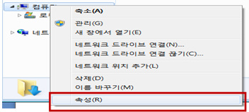
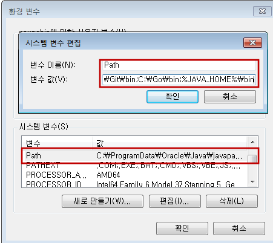
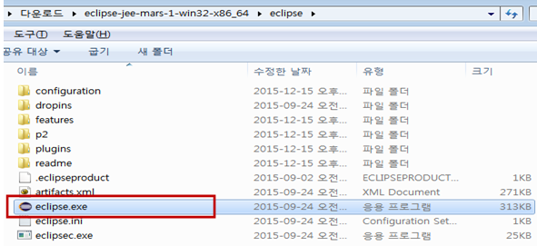
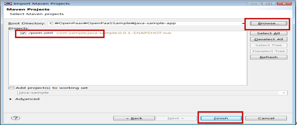
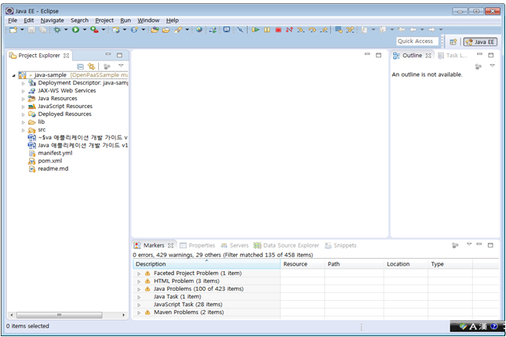

### 1. 개요

#### 1.1. 문서 개요

##### 1.1.1. 목적
본 문서(Java 애플리케이션 개발 가이드)는 Open PaaS프로젝트의 서비스팩(Mysql, Cubrid, MongoDB, RabbitMQ, Radis, GlusterFS)을 Java애플리케이션과 연동하여서비스를 사용하고 애플리케이션을 배포하는 방법에 대해 제시하는 문서이다.

##### 1.1.2. 범위
본 문서의 범위는 Open PaaS 프로젝트의 Java 애플리케이션 개발과 서비스팩 연동에 대한 내용으로 한정되어 있다.

##### 1.1.3. 참고 자료
-   [***http://java.sun.com](https://code.google.com/p/golang-korea/wiki/EffectiveGo)
-   [***http://spring.io](http://spring.io)

### 2. JAVA 애플리케이션 개발가이드

#### 2.1. 개요
Open PaaS에 등록된 다양한 서비스팩을 Java언어로 작성된 애플리케이션과 바인딩하고해당 애플리케이션에 바인딩된 환경정보(VCAP_SERVICES)에서 각 서비스별 접속정보를 획득하여 애플리케이션에 적용하여 이용 할 수 있도록 Windows 환경에서 Java 애플리케이션을 작성 할 수 있도록 한다.
 Java Sample Application은 REST 기반의 서비스를 UI를 제공한다. 사용하는 서비스로는 Mysql, Cubrid, Mongodb, Redis, RabbitMq, GlusterFS를 제공하며, Local 및 OpenPaas 환경에서 사용가능하다. 단, GlusterFs는 Local환경에서 Connection정보를 제공하지 않는다.

#### 2.2. 개발환경 구성
Java 애플리케이션 개발을 위해 다음과 같은 환경으로 개발환경을 구성 한다.
-   OS : Windows 7 64bit
-   Java : 1.8
-   Framwork : Spring-Boot
-   IDE : Eclipse
-   의존성: Maven

##### 2.2.1. JDK설치
1.  JDK 다운로드(1.8)

| http://www.oracle.com/technetwork/java/javase/downloads/index-jsp-138363.html |
|-----------------------------------------------------------------------------------|

1.   다운로드 JDK1.8

2. JDK 설치

  -  jdk-8u65-windows-x64.exe 더블클릭하여 설치를 실행한다.

  -  next 버튼 클릭하여 진행한다.

  -  설치가 진행된다.

  -   Close 버튼 클릭하여 설치를 종료한다.

3. JDK  환경설정
  -   내컴퓨터에서 우측 버튼을 클릭하여 속성을 클릭한다.

  -   고급 시스템설정>고급 텝 > 환경변수 버튼 클릭
  -   시스템 변수 영역 > path 클릭 > jdk설치된 디렉토리의 bin을 path로 추가한다.

4.  eclipse 설치

  - eclipse공식 사이트에서 Eclipse IDE for Java EE Developers 를 다운로드 받는다.

| http://www.eclipse.org/downloads/ |
|-----------------------------------------------------------------------------------|

  - eclipse-jee-mars-1-win32-x86_64.zip을 선택하여 압축해제한다.

  - eclipse.exe 를 클릭한다.  

  - eclipse 초기화면이 나타난다.  

  - 좌측 Project Explore.에서 import를 클릭한다.  

  - Existing Maven Project를 클릭한다.  

  - Browse  버튼을 클릭하여 java-sample 프로제트가있는 폴더를 선택한다. Finish 버튼을 클릭한다.

  - java sample Application이 추가 된것을 확인한다.  

#### 2.2. 개발
  - OpenPaas Java Sample Application은 다음과 같은 구조를 지닌다. Spring-Boot library를 사용하여
별도의 Tomcat설정 없이 구동이 가능합니다. 샘플 애플리케이션에의 데이터 관리는 MySQL, CubridDB, MongoDB 중에 하나를 이용하기 때문에 API 요청시 요청 본문에 DBType 값을 가지고 결정합니다.

  - **OpenPaas Java Sample Application Package 구조**

|**패키지/파일**   |**설명**                 |
|----------|-------------------------|
|Java/sample/biz                  |서비스 영역으로 비지니스 영역입니다.  |
|Java/sample/Config/data          |Mysql, mongodb, redis, glusterFs,cubrid,RabbitMq 등 Persistence영역 접속 설정을 하는 Package입니다.  Local 환경/Cloud 환경을 인식하여 접속한다. Local환경에서는 GlusterFs 설정을 지원하지 않습니다.(Cloud Only)|
            |
|Java/sample /Config/web          |MVC, Interceptor, MultiPart관련 WEB 설정 정보를 Sample Application에 설정합니다.              |
|Java/sample /controller          |UI에서 요청한 정보를 수신하는 컨트롤러 영역 입니다.            |
|Java/sample/dao                  |Persistence 영역의 데이터를 입력/수정/삭제/조회하는 영역입니다.               |
|Java/sample /model               |VO 영역입니다.     |
|Java/sample /Application.java    |Spring Boot을 활용하여 Sample Application을 Start합니다.   |
|Resource/tables                  |Sample Application이 사용할 DB Table DDL 및 기초데이터 DDL이 포함되어 있습니다.       |
|Resource/ application-cloud.properties  |Sample Application이 Cloud 환경에서 사용할 Property입니다. |
|Resource/ application.properties        |Sample Application이 Local환경에서 사용할 Property입니다.  |
|Resource/logback.xml                    |Logback을 활용한 logging 설정 입니다.   |
|Manifest.yml                            |클라우드 환경에서 Application이 최초 구성될때 사용하는 파일로, Sample Application의 환경정보, 서비스 정보(mysql, rabbitmq등의 서비스), application명, 인스턴스 갯수, 인스턴스 메모리 설정등이 포함되어 있습니다.     |
|pom.xml                                 |Sample Application의 Maven의존성을 정의 합니다.     |
|webapp                                 |UI관련 리소스 위치     |
